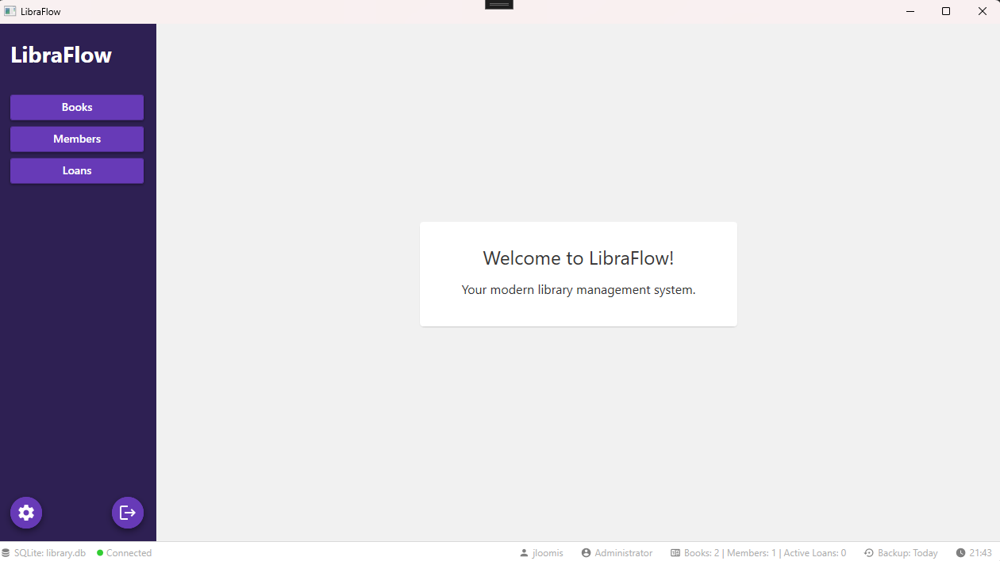
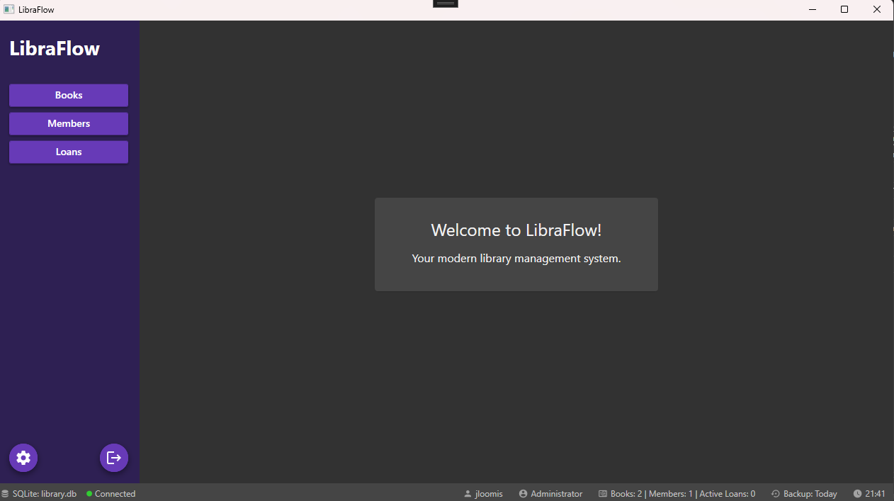

# 📚 LibraFlow

**LibraFlow** is a modern, desktop library management system built using WPF and .NET 8. It features a clean, intuitive UI inspired by Google's Material Design, enabling library staff to easily manage book inventory, member records, and circulation tasks.

> Designed for simplicity, speed, and extensibility.




---

## ✨ Features

- 📖 **Book Management**
  - Add, update, and delete books
  - Track availability (available, checked out, overdue)
- 👥 **Member Management**
  - Create member profiles
  - View borrowing history
- 🔄 **Circulation System**
  - Check in/check out books
  - Automatically updates status and due dates
- 🌓 **Themed UI**
  - Supports Light and Dark modes using Material Design in XAML
- 🧱 **MVVM Architecture**
  - Clean separation of concerns using the CommunityToolkit.MVVM framework
- 💾 **Database**
  - Uses SQLite (`library.db`) — created automatically on first run
- 📦 **Self-Contained Build Support**
  - Ideal for distributing with an installer (e.g. via Inno Setup)

---

## 🛠️ Technologies Used

| Stack        | Details                                         |
|--------------|--------------------------------------------------|
| Frontend     | WPF, XAML, MaterialDesignInXamlToolkit (v5.2.1) |
| Backend      | C# (.NET 8), MVVM Toolkit                        |
| Database     | SQLite (local embedded DB)                      |
| Packaging    | Inno Setup (via `build-release.ps1`)            |

---

## 🚀 Getting Started

### 🧰 Prerequisites

- [Visual Studio 2022](https://visualstudio.microsoft.com/)
- [.NET 8 SDK](https://dotnet.microsoft.com/download/dotnet/8.0)
- NuGet packages:
  - `MaterialDesignThemes`
  - `CommunityToolkit.Mvvm`
  - `Microsoft.Data.Sqlite`

### 🧪 Run the App

1. Clone the repository:
   ```bash
   git clone https://github.com/jloomis92/LibraFlow.git
